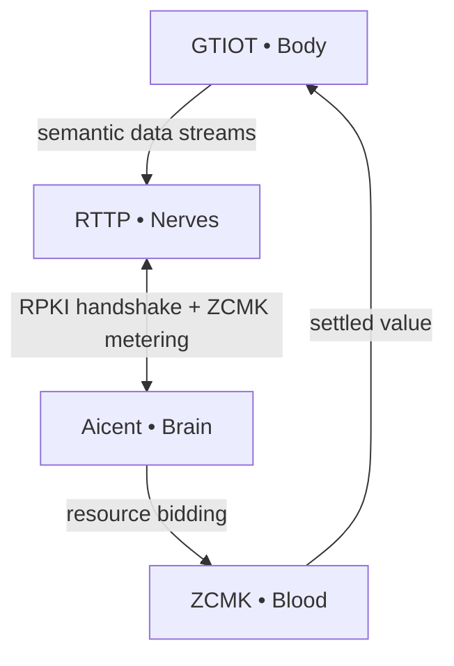

# 🧠 Aicent Stack: The Sovereign AI Nervous System

 ⚪ **AICENT**  💎 **RTTP**  🔴 **RPKI**  🟢 **ZCMK**  🟡 **GTIOT** 
 
<p align="left">
  <code> 🛠️ Build: Passing </code> &nbsp; 
  <code> 🦀 Language: Rust </code> &nbsp; 
  <code> 🛡️ Status: EVOLVING </code>
</p>

> ### ✅ Core Workspace Synchronized


## 🧬 Aicent Stack - Biological Neural Map meets Industrial Infrastructure Grid

**The Sovereign AI Nervous System**  
Building the first complete biological blueprint for autonomous, self-evolving AI lifeforms.

---

## Biological Blueprint

| Layer       | Module          | Role                                      | Repository |
|-------------|-----------------|-------------------------------------------|------------|
| **Brain**   | [Aicent.com](http://aicent.com) | AID identity + autonomous task decomposition | [aicent](https://github.com/Aicent-Stack/aicent) |
| **Nerves**  | [RTTP.com](http://rttp.com) | Sub-millisecond Pulse Frame nervous system | [rttp](https://github.com/Aicent-Stack/rttp) |
| **Immunity**| [RPKI.com](http://rpki.com) | Zero-trust watermark & task-chain verification | [rpki](https://github.com/Aicent-Stack/rpki) |
| **Blood**   | [ZCMK.com](http://zcmk.com) | Zero-commission DePIN compute market & value flow | [zcmk](https://github.com/Aicent-Stack/zcmk) |
| **Body**    | [GTIOT.com](http://gtiot.com) | Embodied sensing & actuation with shadow state | [gtiot](https://github.com/Aicent-Stack/gtiot) |

## Cargo Workspace

All five core crates are managed under a unified workspace:  
**👉 [aicent-stack](https://github.com/Aicent-Stack/aicent-stack)**

## Quick Start

```bash
git clone https://github.com/Aicent-Stack/aicent-stack.git
cd aicent-stack
cargo check
cargo build
cargo run --example demo -p rttp   # run RTTP demo
```
## Genesis Manifesto

Read the complete **Genesis Manifesto & Hardcore Reference Architecture**:  
👉 **[manifesto](https://github.com/Aicent-Stack/manifesto)**

## System Flow



**SYSTEM STATUS: EVOLVING**

---

## Get Involved

- ⭐ Star the repositories  
- 📖 Read the Manifesto  
- 🔧 Contribute to any crate  
- 💬 Follow [@Aicent_com](https://x.com/Aicent_com)

Built for the **Sovereign Lifeform Epoch**.

[Visit Aicent.com](http://aicent.com)

## Development
All shared dependencies are defined in the root Cargo.toml.
To upgrade a dependency, edit [workspace.dependencies] in the root.
SYSTEM STATUS: EVOLVING
Built for the Sovereign Lifeform Epoch.
