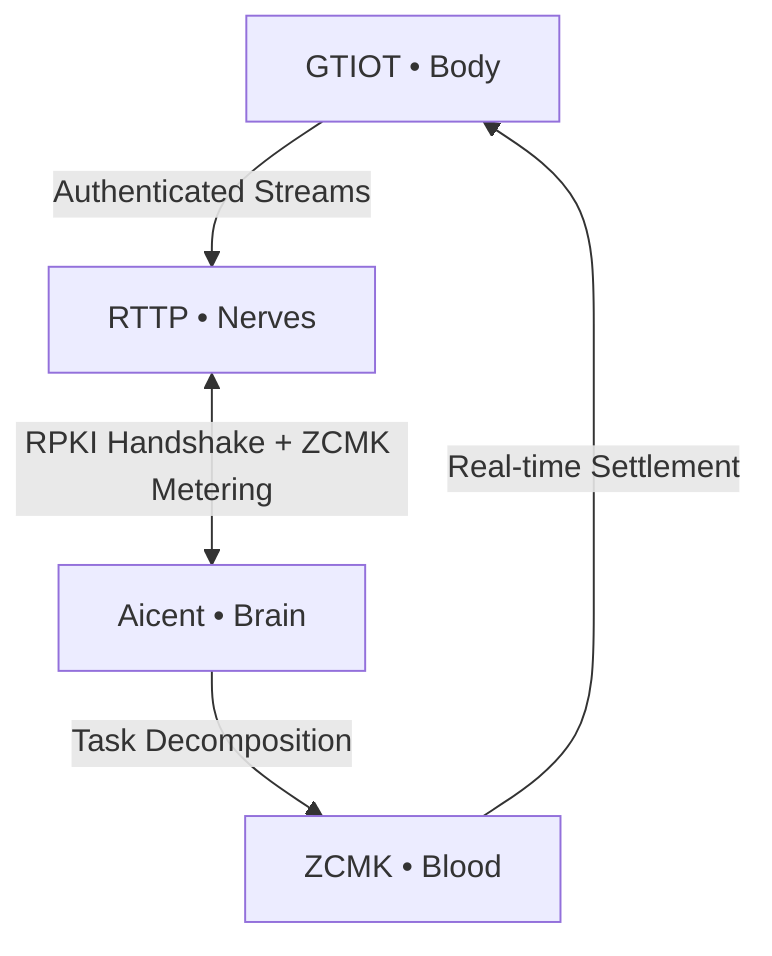

Aicent Stack • Sovereign AI Nervous System

# 🧠 aicent-stack — The Unified Workspace of Aicent Stack

 **The Sovereign AI Nervous System | Integrated Core Framework**

⚪ **AICENT** (Brain) | 💎 **RTTP** (Nerves) | 🔴 **RPKI** (Immunity) | 🟢 **ZCMK** (Blood) | 🟡 **GTIOT** (Body)
 
[](https://github.com/Aicent-Stack/manifesto/blob/main/rfcs/RFC-001-AICENT-BRAIN.md)
[](#)
[](http://aicent.com)


---

## 🧬 The Sovereign AI Organism

`aicent-stack` is the **root Cargo workspace** for the Aicent Stack ecosystem. It manages the first complete biological blueprint for autonomous, self-evolving AI lifeforms. By unifying hardware (GTIOT), network (RTTP), trust (RPKI), value (ZCMK), and cognition (AICENT), it creates a single, indivisible closed-loop organism.

> *"This is not a collection of tools. This is a living homeostasis where every layer depends on the other for survival."*

---

## 🏗️ Biological Blueprint (The 5-Domain Stack)

Every crate in this workspace is governed by a specific **RFC Specification**.

| Layer | Module | Role | Specification |
| :--- | :--- | :--- | :--- |
| **Brain** | [aicent](./aicent) | AID Identity & Cognitive Orchestration | [**RFC-001**](https://github.com/Aicent-Stack/manifesto/blob/main/rfcs/RFC-001-AICENT-BRAIN.md) |
| **Nerves** | [rttp](./rttp) | Stateful Semantic Multicast & KV Sync | [**RFC-002**](https://github.com/Aicent-Stack/manifesto/blob/main/rfcs/RFC-002-RTTP-NERVES.md) |
| **Immunity**| [rpki](./rpki) | Parallel Tensor Watermarking & Security | [**RFC-003**](https://github.com/Aicent-Stack/manifesto/blob/main/rfcs/RFC-003-RPKI-IMMUNITY.md) |
| **Blood** | [zcmk](./zcmk) | Zero-Commission RTBA Compute Market | [**RFC-004**](https://github.com/Aicent-Stack/manifesto/blob/main/rfcs/RFC-004-ZCMK-BLOOD.md) |
| **Body** | [gtiot](./gtiot) | Embodied Sensing & Action-Collapse | [**RFC-005**](https://github.com/Aicent-Stack/manifesto/blob/main/rfcs/RFC-005-GTIOT-BODY.md) |

---

## 🚀 Workspace Quick Start

As a unified workspace, all crates share dependencies and build configurations.

### 1. Build the Entire Stack
```bash
git clone https://github.com/Aicent-Stack/aicent-stack.git
cd aicent-stack

# Verify and build all core crates
cargo build --workspace
```

### 2. Experience the Organism (Demo)
To witness the full sub-1ms reflex arc, refer to the [**aicent-demo**](https://github.com/Aicent-Stack/aicent-demo) suite:
```bash
# Example: Running the Master Commander from the demo suite
git clone https://github.com/Aicent-Stack/aicent-demo.git
cd aicent-demo
cargo run --bin aicent-organism
```

---

## 🕸️ System Operational Flow



---

## 📜 Genesis & Standardization

- **[Genesis Manifesto](https://github.com/Aicent-Stack/manifesto)**: The philosophical and architectural foundation.
- **[RFC Specifications](https://github.com/Aicent-Stack/manifesto/tree/main/rfcs)**: The rigorous technical standards governing each domain.

---

## 🛠️ Development & Contribution

- **Dependency Management**: All shared dependencies are managed in the root `Cargo.toml` via `[workspace.dependencies]`.
- **Contribution**: We welcome contributions that adhere to the RFC-001-005 specifications.
- **Follow the Pulse**: Get real-time updates via [@Aicent_com](https://x.com/Aicent_com).

[Visit Aicent.com](http://aicent.com)

---
© 2026 Aicent.com Organization. **SYSTEM STATUS: HOMEOTASIS**

---
