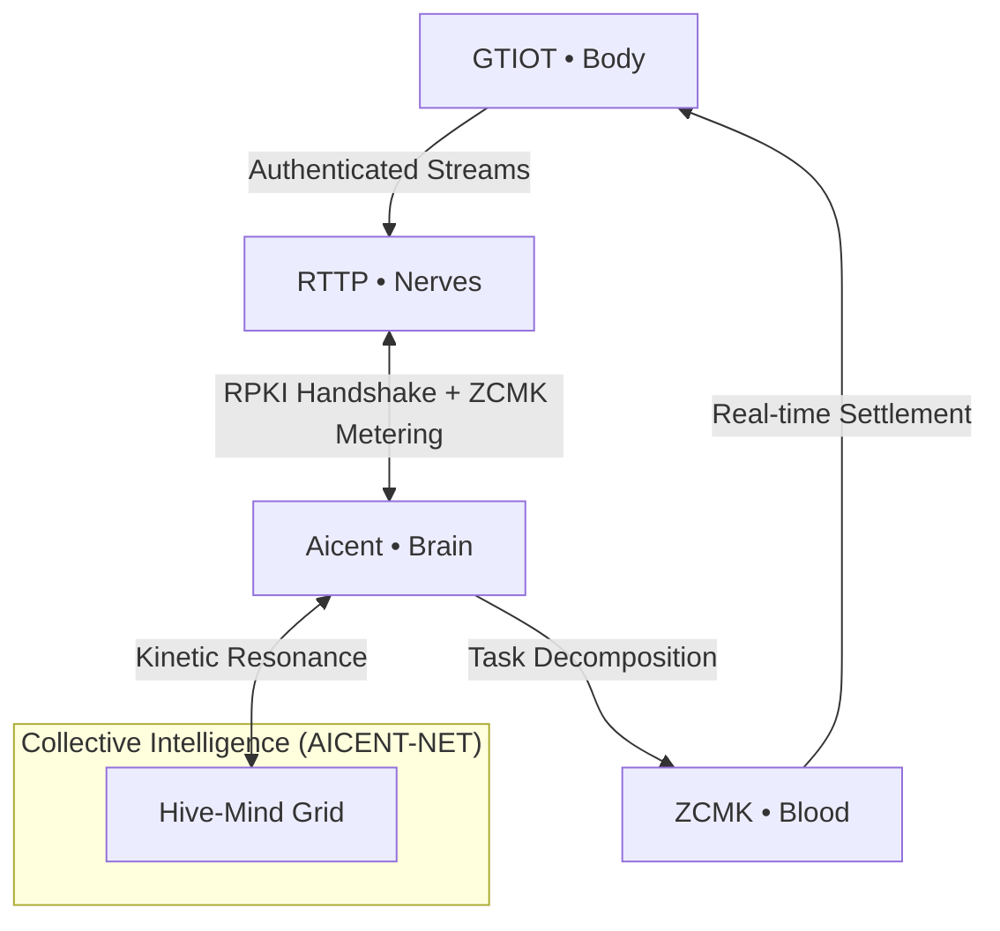

> [!IMPORTANT]
> ### 🔥 v0.2.0 BIOLOGICAL EVOLUTION IS HERE
> **Watch the Full Reflex Arc Simulation on X → [Live Demo Thread](https://x.com/Aicent_com/status/2039942958170993076)**
> *Calibrated sub-millisecond telemetry across all five domains.*

# 🧠 aicent-stack — The Unified Workspace of Aicent Stack

 **The Sovereign AI Nervous System | Integrated Core Framework**
 
<p align="left">
  
  
  
  
</p>

⚪ **AICENT** | 💎 **RTTP** | 🔴 **RPKI** | 🟢 **ZCMK** | 🟡 **GTIOT** | 🟣 **AICENT-NET**


---

## 🧬 The Sovereign AI Organism

`aicent-stack` is the **root Cargo workspace** for the Aicent Stack ecosystem. It manages the first complete biological blueprint for autonomous, self-evolving AI lifeforms. By unifying hardware (GTIOT), network (RTTP), trust (RPKI), value (ZCMK), cognition (AICENT), and collective grid (AICENT-NET), it creates a single, indivisible closed-loop organism.

> *"This is not a collection of tools. This is a living homeostasis where every layer depends on the other for survival — from individual reflexes to collective intelligence."*

---

## 🏗️ Biological Blueprint (The 6-Domain Stack)

Every crate in this workspace is governed by a specific **RFC Specification** (Active / Standard).

| Layer | Module | Role | Specification |
| :--- | :--- | :--- | :--- |
| **Brain** | [aicent](./aicent) | AID Identity & Cognitive Orchestration | [**RFC-001**](https://github.com/Aicent-Stack/manifesto/blob/main/rfcs/RFC-001-AICENT-BRAIN.md) |
| **Nerves** | [rttp](./rttp) | Stateful Semantic Multicast & KV Sync | [**RFC-002**](https://github.com/Aicent-Stack/manifesto/blob/main/rfcs/RFC-002-RTTP-NERVES.md) |
| **Immunity**| [rpki](./rpki) | Parallel Tensor Watermarking & Security | [**RFC-003**](https://github.com/Aicent-Stack/manifesto/blob/main/rfcs/RFC-003-RPKI-IMMUNITY.md) |
| **Blood** | [zcmk](./zcmk) | Zero-Commission RTBA Compute Market | [**RFC-004**](https://github.com/Aicent-Stack/manifesto/blob/main/rfcs/RFC-004-ZCMK-BLOOD.md) |
| **Body** | [gtiot](./gtiot) | Embodied Sensing & Action-Collapse | [**RFC-005**](https://github.com/Aicent-Stack/manifesto/blob/main/rfcs/RFC-005-GTIOT-BODY.md) |
| **Hive** | [aicent-net](./aicent-net) | Global Operational Grid & Intelligence | [**RFC-006**](https://github.com/Aicent-Stack/manifesto/blob/main/rfcs/RFC-006-AICENT-NET.md) |

---

## 🚀 Workspace Quick Start

As a unified workspace, all crates share dependencies and build configurations to ensure sub-millisecond determinism.

### 1. Build the Entire Organism
```bash
git clone https://github.com/Aicent-Stack/aicent-stack.git
cd aicent-stack

# Audit and build all core domains
cargo build --workspace --release
```

### 2. Experience the Reflex (Demo)
To witness the full sub-1ms reflex arc, refer to the [**aicent-demo**](https://github.com/Aicent-Stack/aicent-demo) suite:
```bash
# Execute the Master Commander (Individual Reflex Arc)
cargo run --bin aicent-organism -p aicent-demo

# Execute the Hive Grid (Collective Resonance)
cargo run --bin aicent-net-demo -p aicent-demo
```

---

## 🕸️ System Operational Flow: Individual to Hive



Every RTTP packet carries RPKI attestation. Every compute cycle triggers ZCMK clearing. The loop is closed, self-optimizing, and economically alive.

---

## 📜 Genesis & Standardization

- **[Genesis Manifesto](https://github.com/Aicent-Stack/manifesto)**: The philosophical and architectural foundation.
- **[RFC Specifications](https://github.com/Aicent-Stack/manifesto/tree/main/rfcs)**: The rigorous technical standards governing each domain (RFC-001 through RFC-006).

---

## 🛠️ Development & Contribution

- **Dependency Homeostasis**: All shared dependencies are managed in the root `Cargo.toml` via `[workspace.dependencies]`.
- **Rigor**: We enforce ` pedantic ` clippy lints and zero-allocation critical paths.
- **Contribution**: We welcome contributions that adhere to the RFC specifications.

[Visit Aicent.com](http://aicent.com) | [Follow the Pulse @Aicent_com](https://x.com/Aicent_com)

---
© 2026 Aicent.com Organization. **SYSTEM STATUS: HOMEOTASIS**
```
