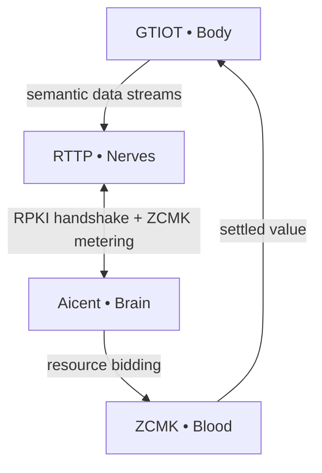

# 🧠 Aicent Stack: The Sovereign AI Nervous System

 ⚪ **AICENT**  💎 **RTTP**  🔴 **RPKI**  🟢 **ZCMK**  🟡 **GTIOT** 
 
<p align="left">
  <code> 🛠️ Build: Passing </code> &nbsp; 
  <code> 🦀 Language: Rust </code> &nbsp; 
  <code> 🛡️ Status: EVOLVING </code>
</p>

> ### ✅ Core Workspace Synchronized


## 🧬 Aicent Stack - Biological Neural Map meets Industrial Infrastructure Grid

**Cargo Workspace for Aicent Stack**  
Unified dependency and build management for the 5 core protocol crates.

## Structure

This workspace manages the following crates:

- **[aicent](https://github.com/Aicent-Stack/aicent)** — Brain (决策中枢)
- **[rttp](https://github.com/Aicent-Stack/rttp)** — Nerves (神经系统)
- **[rpki](https://github.com/Aicent-Stack/rpki)** — Immunity (免疫系统)
- **[zcmk](https://github.com/Aicent-Stack/zcmk)** — Blood (价值流转)
- **[gtiot](https://github.com/Aicent-Stack/gtiot)** — Body (具身执行)

## Quick Start

```bash
git clone https://github.com/Aicent-Stack/aicent-stack.git
cd aicent-stack
cargo check          # 检查所有 crate
cargo build          # 构建所有 crate
cargo run --example demo -p rttp   # 运行 RTTP demo
## Cargo Workspace

All five core crates are managed under a unified workspace:  
**👉 [aicent-stack](https://github.com/Aicent-Stack/aicent-stack)**

```bash
git clone https://github.com/Aicent-Stack/aicent-stack.git
cd aicent-stack
cargo check
```

## Genesis Manifesto

Read the complete **Genesis Manifesto & Hardcore Reference Architecture**:  
👉 **[manifesto](https://github.com/Aicent-Stack/manifesto)**

## System Flow



**SYSTEM STATUS: EVOLVING**

---

## Get Involved

- ⭐ Star the repositories  
- 📖 Read the Manifesto  
- 🔧 Contribute to any crate  
- 💬 Follow [@Aicent_com](https://x.com/Aicent_com)

Built for the **Sovereign Lifeform Epoch**.

[Visit Aicent.com](http://aicent.com)
